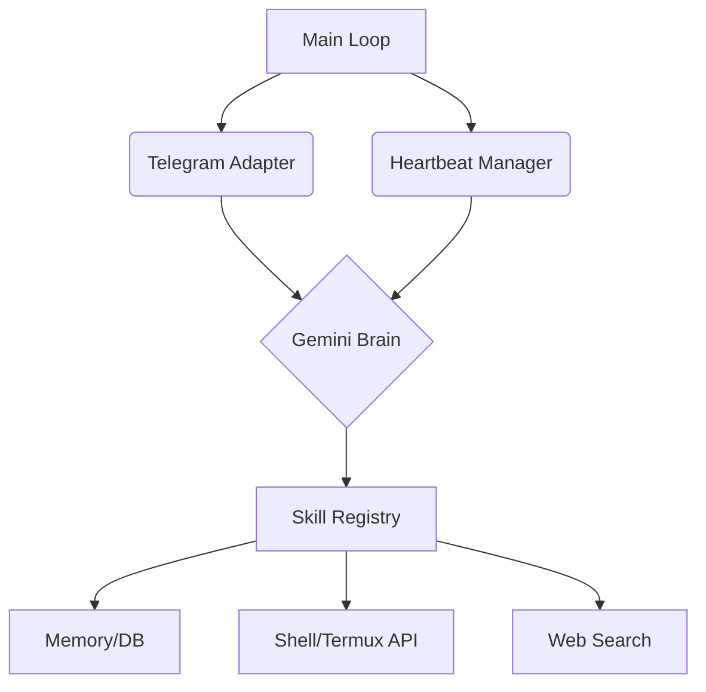

# 🤖 Jovibe Agent

[](https://github.com/Joweb1/Jovibe-Agent/blob/main/LICENSE)
[](https://github.com/Joweb1/Jovibe-Agent/stargazers)
[](https://github.com/Joweb1/Jovibe-Agent/actions/workflows/ci.yml)
[](https://www.python.org/downloads/)

**Jovibe Agent** is a sophisticated, modular AI assistant designed to live in your terminal and messaging apps. Built on Google's Gemini LLM, it features a unique dual-mode architecture: **Reactive** (responding to messages) and **Proactive** (autonomously managing tasks via a background "heartbeat").

Optimized for **Termux** on Android, it bridges the gap between a mobile LLM and a powerful system automation tool.

---

## 🚀 Key Features

- **🧠 Dual-Mode Intelligence**: 
  - **Reactive**: Real-time interaction via Telegram (with Discord support planned).
  - **Proactive**: A "Heartbeat" loop that periodically monitors `HEARTBEAT.md` to perform background tasks without user prompts.
- **🛠️ Tool-Augmented (Function Calling)**:
  - **Web Access**: Search and fetch content from the internet.
  - **File System**: Read, write, and search files locally.
  - **System Control**: Execute shell commands and access Termux-specific APIs (Camera, Notifications).
- **💾 Long-Term Memory**: Uses a persistent SQLite database and structured `.md` files to maintain identity (`soul.md`) and user preferences (`user.md`).
- **📦 Seamless Installation**: Global CLI integration. Run `jovibe` from any directory.
- **🛡️ Secure Auth**: Supports both API Keys and OAuth2 flows for Google services.

---

## 📥 Installation

### **Termux (Android)**
We provide a one-click installer for Termux users:

```bash
git clone https://github.com/Joweb1/Jovibe-Agent.git
cd Jovibe-Agent
chmod +x install_termux.sh
./install_termux.sh
```

### **Standard Linux/macOS**
```bash
pip install .
```

---

## ⚙️ Configuration

Jovibe Agent stores its state in `~/.jovibe`. 

1. Edit the environment variables:
   ```bash
   nano ~/.jovibe/.env
   ```
2. Required keys:
   - `GEMINI_API_KEY`: Your Google AI Studio key.
   - `TELEGRAM_TOKEN`: Your bot token from @BotFather.
   - `GEMINI_MODEL`: (Optional) Defaults to `gemini-2.0-flash`.

---

## 🎮 Usage

Simply run the command from your terminal:
```bash
jovibe
```

### **Core Commands (via Telegram/Terminal)**
- `manage_todos(action='list')`: View your current task list.
- `execute_shell_command(command='pkg upgrade')`: Maintain your system.
- `save_memory_fact(fact='I prefer dark mode')`: Update the agent's long-term memory.

---

## 🏗️ Architecture



- **`src/main.py`**: Entry point and service orchestrator.
- **`src/heartbeat.py`**: Proactive logic controller.
- **`src/llm.py`**: Gemini API integration and tool-calling logic.
- **`src/skills/`**: Extensible plugin system for agent capabilities.
- **`src/memory/`**: SQLite & Markdown-based persistence layer.

---

## 🛠️ Development

### **Running Tests**
```bash
pytest
```

### **Adding New Skills**
Skills are simple Python functions. Decorate them with `@SkillRegistry.register()` in `src/skills/default.py` and they will automatically be available to the LLM.

---

## 📜 License

Distributed under the MIT License. See `LICENSE` for more information.

---

## 🤝 Contributing

Contributions are what make the open-source community such an amazing place to learn, inspire, and create. Any contributions you make are **greatly appreciated**.

1. Fork the Project
2. Create your Feature Branch (`git checkout -b feature/AmazingFeature`)
3. Commit your Changes (`git commit -m 'Add some AmazingFeature'`)
4. Push to the Branch (`git push origin feature/AmazingFeature`)
5. Open a Pull Request

---

*Built with ❤️ by [Joweb1](https://github.com/Joweb1)*
